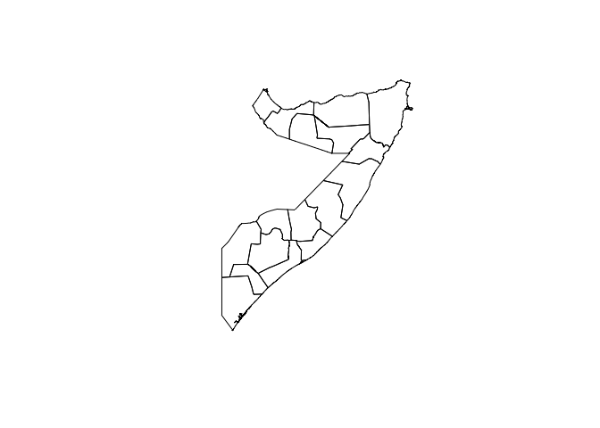
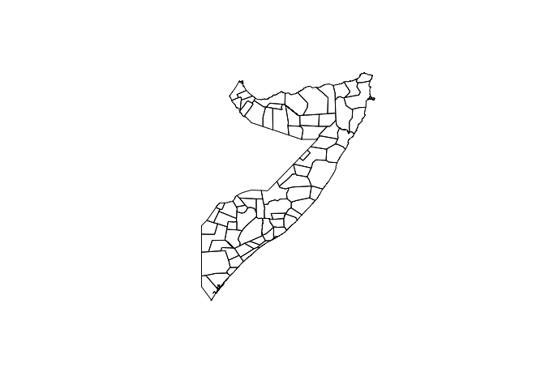
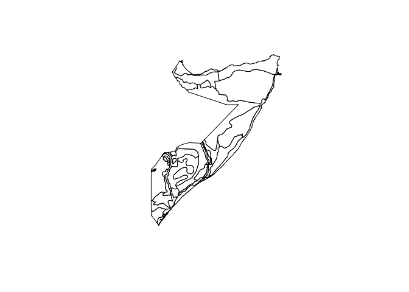
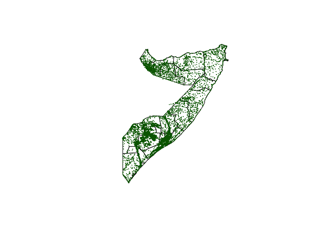

<!-- README.md is generated from README.Rmd. Please edit that file -->

# somalia: Datasets for Use in Designing Surveys in Somalia 

[](https://www.repostatus.org/#active)
[](https://www.tidyverse.org/lifecycle/#maturing)
[](https://cran.r-project.org/package=somalia)
[](https://travis-ci.org/validmeasures/somalia)
[](https://ci.appveyor.com/project/validmeasures/somalia)

Designing surveys require relevant datasets to be used as basis for
sample size calculations, sampling design, survey planning/logistics and
survey implementation. These include datasets on population, lists of
sampling clusters, map datasets for spatial sampling, and previous
survey datasets that can be used for estimating indicator variance and
design effects. This package contains relevant datasets for use in
designing surveys in Somalia.

## Installation

`somalia` is not yet released on [CRAN](https://cran.r-project.org).

You can install the development version of `somalia` from
[GitHub](https://github.com/validmeasures/somalia) with:

``` r
if(!require(devtools)) install.packages("devtools") 
install_github("validmeasures/somalia")
```

## Usage

The `somalia` package has the following datasets.

### Somalia map datasets

Four map datasets are included in the `somalia` pacakge. These are:

  - Administrative level 1 or region map of Somalia (`district_map`)

  - Administrative level 2 or district map of Somalia (`region_map`)

  - Livelihood zones map of Somalia (`lhz2015`)

  - Villages (with geographical coordinates) of Somalia (`villages`)

The administrative level 1 or region map, administrative level 2 or
district map and livelihoods zones map of Somalia are provided as a
dataset class `SpatialPolygonsDataFrame`. These datasets are taken from
the [Humanitarian Data
Exchange](https://data.humdata.org/dataset/somalia-administrative-boundaries)
in [ESRI Shapefile format](https://support.esri.com/en/white-paper/279)
and then converted into `SpatialPolygonsDataFrame`.

The villages of Somalia with geographical coordinates dataset is
provided by [UNICEF Somalia](https://www.unicef.org/somalia/).

### Accessing area information from map datasets

Underlying area information for the regions, districts and livelihood
zones of Somalia can be accessed from the `SpatialPolygonsDataFrame` as
follows:

``` r
## Regions dataset
somalia::region_map@data
```

    #>   OBJECTID  admin1Name admin1Pcod  admin1RefN    admin1AltN admin1Al_1
    #> 0        1       Awdal       SO11       Awdal          <NA>       <NA>
    #> 1        2      Bakool       SO25      Bakool          <NA>       <NA>
    #> 2        3     Banadir       SO22     Banadir      Banaadir       <NA>
    #> 3        4        Bari       SO16        Bari          <NA>       <NA>
    #> 4        5         Bay       SO24         Bay          <NA>       <NA>
    #> 5        6   Galgaduud       SO19   Galgaduud      Galgadud       <NA>
    #> 6        7        Gedo       SO26        Gedo          <NA>       <NA>
    #> 7        8      Hiraan       SO20      Hiraan       Hiiraan       <NA>
    #> 8        9 Middle Juba       SO27 Middle Juba Jubbada Dhexe       <NA>
    #> 9       10  Lower Juba       SO28  Lower Juba Jubbada Hoose       <NA>
    #>   admin0Name admin0Pcod       date    validOn validTo Shape_Leng
    #> 0    Somalia         SO 2014/06/06 2017/04/05    <NA>  5.6593658
    #> 1    Somalia         SO 2014/06/06 2017/04/05    <NA>  6.6501524
    #> 2    Somalia         SO 2014/06/06 2017/04/05    <NA>  0.8642052
    #> 3    Somalia         SO 2014/06/06 2017/04/05    <NA> 12.2115799
    #> 4    Somalia         SO 2014/06/06 2017/04/05    <NA>  8.0841467
    #> 5    Somalia         SO 2014/06/06 2017/04/05    <NA>  9.0452721
    #> 6    Somalia         SO 2014/06/06 2017/04/05    <NA>  9.0406244
    #> 7    Somalia         SO 2014/06/06 2017/04/05    <NA>  7.1430734
    #> 8    Somalia         SO 2014/06/06 2017/04/05    <NA>  6.1970812
    #> 9    Somalia         SO 2014/06/06 2017/04/05    <NA> 11.3094875
    #>   Shape_Area
    #> 0 1.31247932
    #> 1 2.10193142
    #> 2 0.01961927
    #> 3 5.61837157
    #> 4 3.57320792
    #> 5 3.99755585
    #> 6 3.66494234
    #> 7 2.77319084
    #> 8 1.52671358
    #> 9 3.89202081

``` r
## Districts dataset
somalia::district_map@data
```

    #>   OBJECTID_1 admin2Name admin2Pcod admin2RefN admin2AltN admin2Al_1
    #> 0          1    Banadir     SO2201    Banadir       <NA>       <NA>
    #> 1          2     Borama     SO1101     Borama    Boorama       <NA>
    #> 2          3       Baki     SO1102       Baki       <NA>       <NA>
    #> 3          4    Lughaye     SO1103    Lughaye       <NA>       <NA>
    #> 4          5     Zeylac     SO1104     Zeylac     Saylac       <NA>
    #> 5          6   Hargeysa     SO1201   Hargeysa   Hargeisa       <NA>
    #> 6          7    Berbera     SO1202    Berbera       <NA>       <NA>
    #> 7          8    Gebiley     SO1203    Gebiley    Gabiley       <NA>
    #> 8          9      Burco     SO1301      Burco      Burao       <NA>
    #> 9         10  Buuhoodle     SO1302  Buuhoodle    Buhodle       <NA>
    #>        admin1Name admin1Pcod admin0Name admin0Pcod       date    validOn
    #> 0         Banadir       SO22    Somalia         SO 2014/06/06 2017/04/05
    #> 1           Awdal       SO11    Somalia         SO 2014/06/06 2017/04/05
    #> 2           Awdal       SO11    Somalia         SO 2014/06/06 2017/04/05
    #> 3           Awdal       SO11    Somalia         SO 2014/06/06 2017/04/05
    #> 4           Awdal       SO11    Somalia         SO 2014/06/06 2017/04/05
    #> 5 Woqooyi Galbeed       SO12    Somalia         SO 2014/06/06 2017/04/05
    #> 6 Woqooyi Galbeed       SO12    Somalia         SO 2014/06/06 2017/04/05
    #> 7 Woqooyi Galbeed       SO12    Somalia         SO 2014/06/06 2017/04/05
    #> 8        Togdheer       SO13    Somalia         SO 2014/06/06 2017/04/05
    #> 9        Togdheer       SO13    Somalia         SO 2014/06/06 2017/04/05
    #>   ValidTo Shape_Leng Shape_Area
    #> 0    <NA>  0.8642052 0.01961927
    #> 1    <NA>  2.4036976 0.25479842
    #> 2    <NA>  2.8715734 0.28236041
    #> 3    <NA>  2.3342717 0.27573735
    #> 4    <NA>  3.8520475 0.49958315
    #> 5    <NA>  4.5845553 1.12903713
    #> 6    <NA>  5.0865557 0.84711370
    #> 7    <NA>  2.5344524 0.35262137
    #> 8    <NA>  5.2240354 1.32260622
    #> 9    <NA>  2.9924082 0.55790595

``` r
## Livelihoods zones dataset
somalia::lhz2015@data
```

    #>   COUNTRY LZNUM LZCODE                                      LZNAME CLASS
    #> 0      SO     1   SO01                              Guban Pastoral  AN04
    #> 1      SO     2   SO02                         West Golis Pastoral  SH01
    #> 2      SO     3   SO03                   Northwestern Agropastoral  AG04
    #> 3      SO     4   SO04                       Togdheer Agropastoral  CC01
    #> 4      SO     5   SO05                               Hawd Pastoral  PS01
    #> 5      SO     6   SO06    Northern Inland Pastoral Goats and Sheep  AS06
    #> 6      SO     7   SO07 East Golis Frankincense, Goats, and Fishing  AS09
    #> 7      SO     8   SO08           Coastal Deeh Pastoral and Fishing  FS01
    #> 8      SO     9   SO09                              Addun Pastoral  PS04
    #> 9      SO    10   SO10                    Cowpea Belt Agropastoral  AG12

### Plotting map datasets

Map datasets can be mapped using the `plot()` function in the `sp`
package. This is implemented as follows:

1.  Map of Regions of Somalia

<!-- end list -->

``` r
sp::plot(somalia::region_map)
```



2.  Map of Districts of Somalia

<!-- end list -->

``` r
sp::plot(somalia::district_map)
```



3.  Map of Livelihood Zones of Somalia

<!-- end list -->

``` r
sp::plot(somalia::lhz2015)
```



4.  Map of villages of Somalia

<!-- end list -->

``` r
sp::plot(somalia::region_map)
points(somalia::villages[ , c("longitude", "latitude")], pch = 20, cex = 0.1, col = "darkgreen")
```


